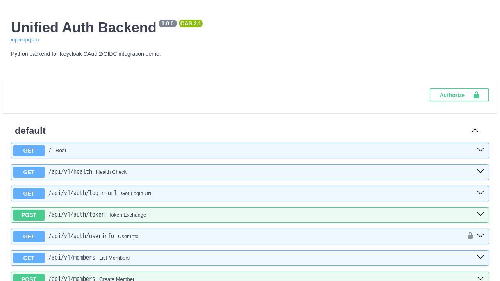
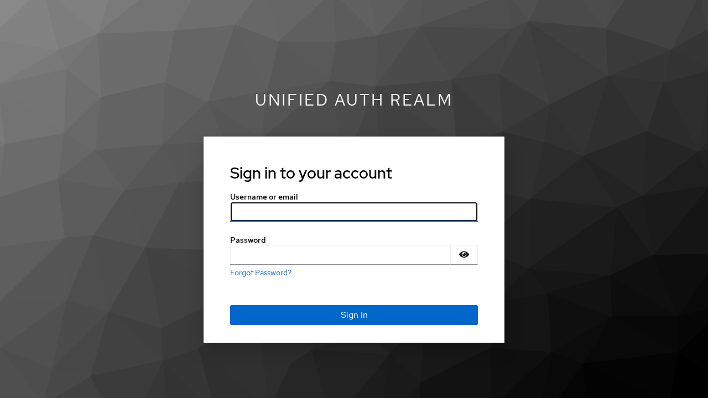
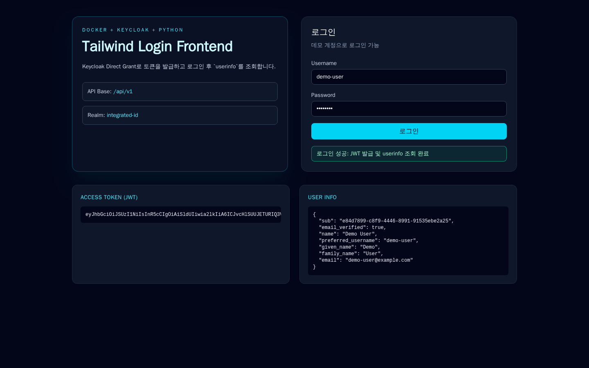

# Docker-Keycloak-OAuth2

Keycloak 기반 통합 인증(SSO) 구조를 Python 백엔드로 연동한 PoC 저장소입니다.  
요청하신 기술 스택( `Keycloak + OAuth2/OIDC + PostgreSQL + Docker` )을 기준으로 실행 가능한 구성까지 포함합니다.

## 1. 구현 목표

1. 통합 인증 서버(IdP)
- Keycloak 기반 인증 서버
- OAuth2 / OpenID Connect 기반 인증
- Access Token / Refresh Token 발급 및 검증

2. 회원 관리
- 단일 사용자 식별자(`customer_id`) 기반 관리
- 회원 단계 개념 지원  
  (`visitor` → `consulting_customer` → `member` → `service_user` → `medical_service_user`)
- 계정 상태 관리 (`active`, `dormant`, `withdrawn`)

3. 동의 관리
- 공통 동의 + 서비스별 동의 구조
- 필수/선택 동의 구분
- 목적/버전/국가/언어 단위 동의 이력 관리

## 2. 실제 구성(현재 저장소)

- `backend` : FastAPI(Python) 기반 API 서버
- `frontend` : Tailwind 기반 로그인 UI (`/app-ui`, backend static 서빙)
- `keycloak` : OAuth2/OIDC IdP
- `postgres` : Keycloak + Backend 데이터 저장
- `capture` : 실행 화면 캡처용 Playwright 컨테이너

## 3. 기술 스택

- BE: Python 3.12, FastAPI, SQLAlchemy, httpx
- FE: HTML + Tailwind CSS
- IdP: Keycloak 26
- Auth Protocol: OAuth2, OpenID Connect
- DB: PostgreSQL 16
- Infra: Docker Compose

## 4. 아키텍처

```text
[Client(Web/App)]
      |
      v
[Python Backend(FastAPI)] <----> [Keycloak]
      |                               |
      v                               v
   [PostgreSQL] <---------------------+
```

## 5. 실행 방법

### 5.1 사전 요구사항

- Docker
- Docker Compose

### 5.2 컨테이너 기동

일반 환경:

```bash
docker compose up -d --build
```

`docker-buildx`가 없는 환경:

```bash
DOCKER_BUILDKIT=0 docker compose up -d --build
```

상태 확인:

```bash
docker compose ps
```

중지:

```bash
docker compose down
```

## 6. 접속 정보

- Backend Swagger: http://localhost:8000/docs
- Backend OpenAPI: http://localhost:8000/openapi.json
- Frontend(Login UI): http://localhost:8000/app-ui
- Keycloak: http://localhost:8080
- Keycloak Realm: `integrated-id`

기본 계정/클라이언트:

- Keycloak Admin: `admin / admin1234`
- Demo User1: `demo-user / demo1234`
- Demo User2: `demo-user2 / demo2234`
- Demo User3: `demo-user3 / demo3234`
- OIDC Client: `be-client` (secret: `be-client-secret`)

## 7. 계정/JWT/로그인 테스트 자동 실행

다음 스크립트를 실행하면 아래를 한 번에 수행합니다.

- 로그인 가능한 계정 3개 보장 생성
- JWT 3개 발급
- 계정별 로그인(token/userinfo) 테스트
- 결과 파일 저장

```bash
./scripts/provision-users-and-test.sh
```

산출물:

- `artifacts/jwt-tokens.json` (JWT 3개 포함)
- `artifacts/login-test-results.json` (로그인 테스트 결과)

최근 테스트 결과 예시:

- `overall_passed: true`
- `demo-user`: token 200 / userinfo 200
- `demo-user2`: token 200 / userinfo 200
- `demo-user3`: token 200 / userinfo 200

## 8. API 요약

| Method | Path | 설명 |
|---|---|---|
| GET | `/api/v1/health` | DB/Keycloak 연결 상태 |
| GET | `/api/v1/auth/login-url` | Keycloak 인증 URL |
| POST | `/api/v1/auth/token` | Keycloak 토큰 발급(Direct Grant) |
| GET | `/api/v1/auth/userinfo` | Access Token 기반 사용자 정보 |
| POST | `/api/v1/members` | 회원 생성 |
| GET | `/api/v1/members` | 회원 목록 |
| PATCH | `/api/v1/members/{customer_id}/status` | 회원 상태 변경 |
| POST | `/api/v1/consents` | 동의 생성 |
| GET | `/api/v1/members/{customer_id}/consents` | 회원 동의 조회 |

### 8.1 예시: 토큰 발급 및 사용자 정보 조회

```bash
curl -X POST http://localhost:8000/api/v1/auth/token \
  -H "Content-Type: application/json" \
  -d '{"username":"demo-user","password":"demo1234"}'
```

```bash
TOKEN="<access_token>"
curl http://localhost:8000/api/v1/auth/userinfo \
  -H "Authorization: Bearer ${TOKEN}"
```

## 9. 실행 화면 캡처

스크린샷 재생성:

```bash
./scripts/capture-screens.sh
```

저장 경로:

- `captures/backend-swagger.png`
- `captures/keycloak-login.png`
- `captures/fe-login-success.png` (로그인 성공 후 화면)

### 9.1 Backend Swagger



### 9.2 Keycloak Login



### 9.3 Frontend Login Success



## 10. 디렉토리 구조

```text
.
├── backend
│   ├── app
│   │   ├── auth.py
│   │   ├── config.py
│   │   ├── db.py
│   │   ├── main.py
│   │   ├── models.py
│   │   └── schemas.py
│   ├── Dockerfile
│   └── requirements.txt
├── captures
│   ├── backend-swagger.png
│   ├── fe-login-success.png
│   └── keycloak-login.png
├── artifacts
│   ├── jwt-tokens.json
│   └── login-test-results.json
├── docker-compose.yml
├── infra
│   ├── keycloak/realm/integrated-id-realm.json
│   └── postgres/init/01-init-databases.sql
├── scripts/capture-fe-login-success.js
├── scripts/provision-users-and-test.sh
└── scripts/capture-screens.sh
```

## 11. 운영 전 고려사항

- Direct Grant 비활성화 및 표준 Authorization Code(+PKCE) 적용
- Client Secret/DB 계정 등 민감정보를 `.env` 및 Secret Manager로 분리
- Keycloak/Backend TLS 적용 및 리버스 프록시(Nginx, Ingress) 구성
- 동의 이력 감사 로그 및 의료/비의료 데이터 분리 저장소 설계
